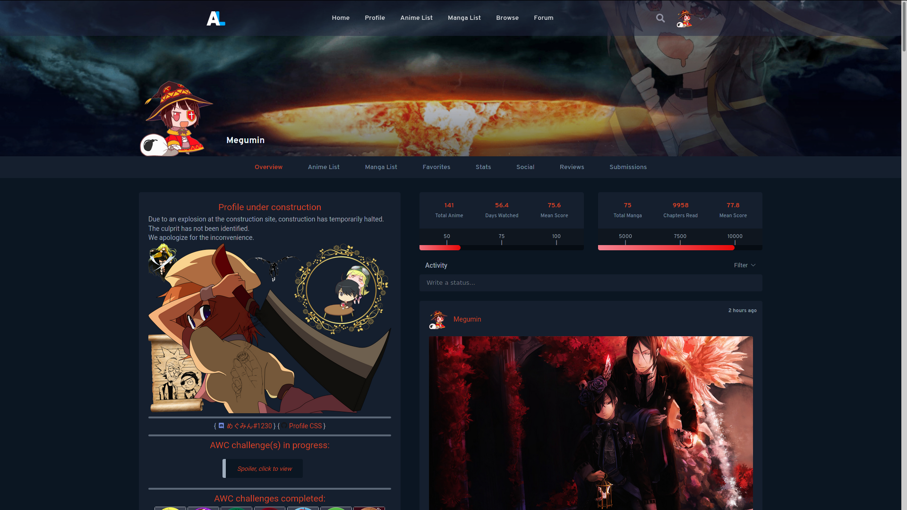
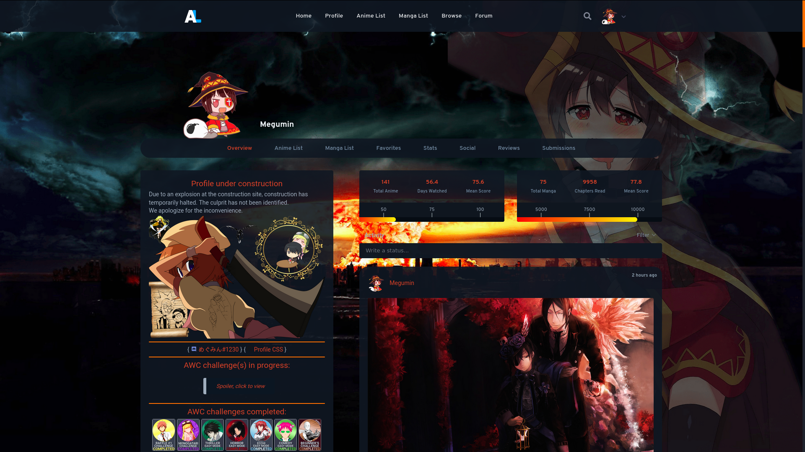
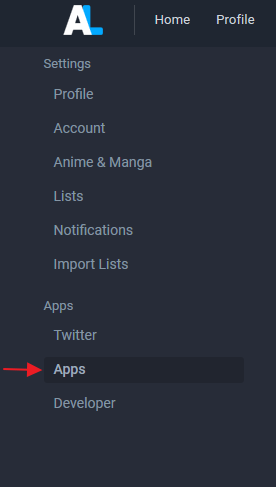
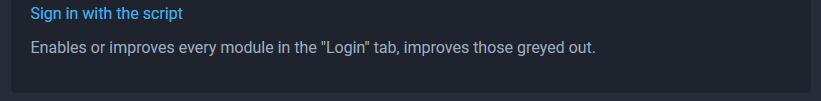
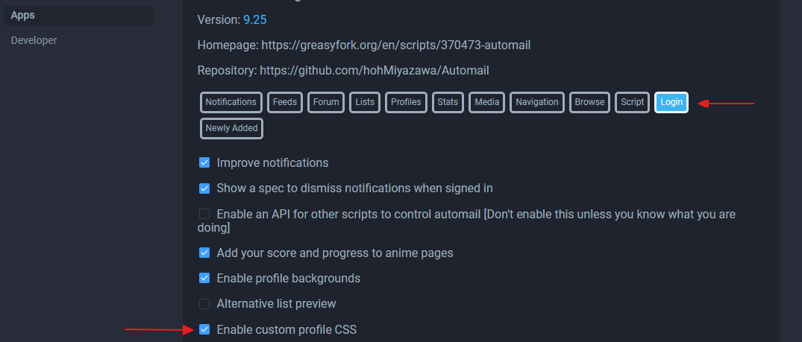
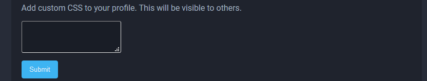

# anilist-css
Hoh's userscript (Automail) adds a bunch of cool features to anilist.co
 One of them is the ability to add custom CSS to your profile.
 **Scroll down for installation guide**

Before: 
After:

The option to add css can be found here: https://anilist.co/settings/apps (at the bottom of the page).

# Super Easy Installation Guide:
>**Hint: Ctrl + Left-Click to open a link in a new tab.**
## Part 1: Installing the script
* Install the <a href="https://www.tampermonkey.net/"> Tampermonkey </a>plugin for your browser. (**Supported Browsers:**  Chrome, Microsoft Edge, Safari, Opera Next, and Firefox.)
* After it is installed, install hoh's <a href="https://greasyfork.org/en/scripts/370473-automail">automail</a> script.
* If you can see my background image, then the script is running. -> https://anilist.co/user/Megumin/

## Part 2: Enabling custom profile CSS
1. Go to the "Apps" section in your Settings.
 
2. Scroll to the bottom.
3. Click "Sign in with the script"
 
4. Go back to the "Apps" section in your Settings. Near the top of the page, click on the login tab.
 
5. Tick the "Enable custom profile css" textbox.

## Part 3: Adding CSS
Now for adding some extra css effects.
1. Go to the "Apps" section in your Settings.
 
2. Scroll to the bottom. You will see a part called: "Add custom CSS to your profile."
In the textbox below that title, you can add your css.

3. CSS:  
   CSS (Raw):  
4. Open the general-style.css link above, copy the text, and paste it in the textbox. (Or you can open the raw link for easier copy/pasting)
5. You probably want to change the background image, so read <b>Part 4</b> before clicking Submit.
6. Click Submit.
Go to your profile, the changes should now take effect.

## Part 4: Adding/changing the background image
1. In <b>Part 3</b>, a background image was added as part of the code you copied.
2. To change the background image, at the top of the code you copied, there will be a part that looks like this: url("https://w.wallhaven.cc/full/5d/wallhaven-5d1e19.png")
3. Change the url to the url of the image you want.
4. Click Submit.
Go to your profile, it should now have your own background image.

If you only want a background image, and no extra effects, during <b>Part 3</b>, instead of copying all the code, only copy the following:
 body {
    background: rgb(var(--color-background)) url("https://w.wallhaven.cc/full/5d/wallhaven-5d1e19.png") center/100% fixed
}

Everything should be working perfectly now.

## general-style.css features:
* Background image
* Avatars on activity posts get rounded corners and enlarge on mouse hover.
* All items in favourites section get rounded corners and also enlarge on mouse hover.
* Activity section posts get rounded corners.
* Thin scrollbar.

Note:  is the CSS I use for my profile. It is similar to , but with some extra features. You can use it if you want.
